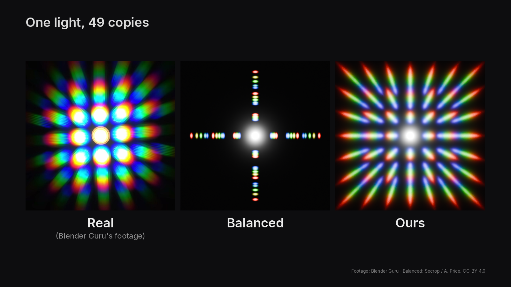
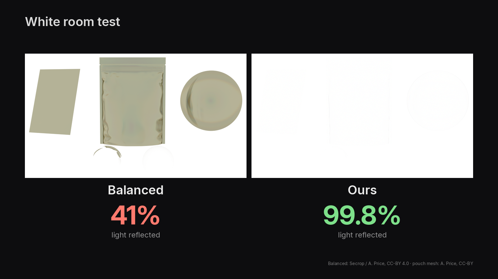
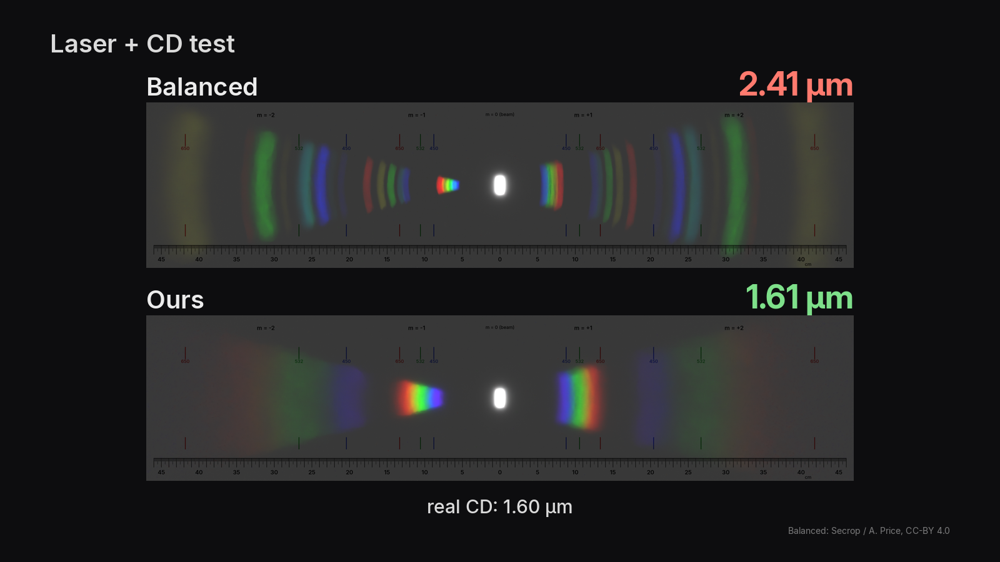
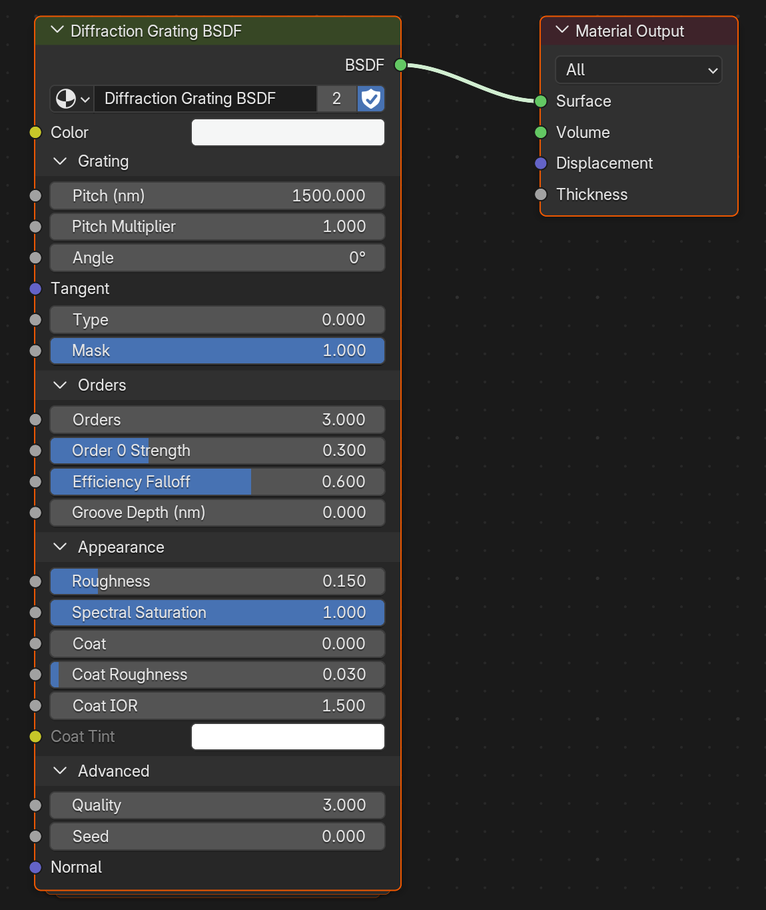
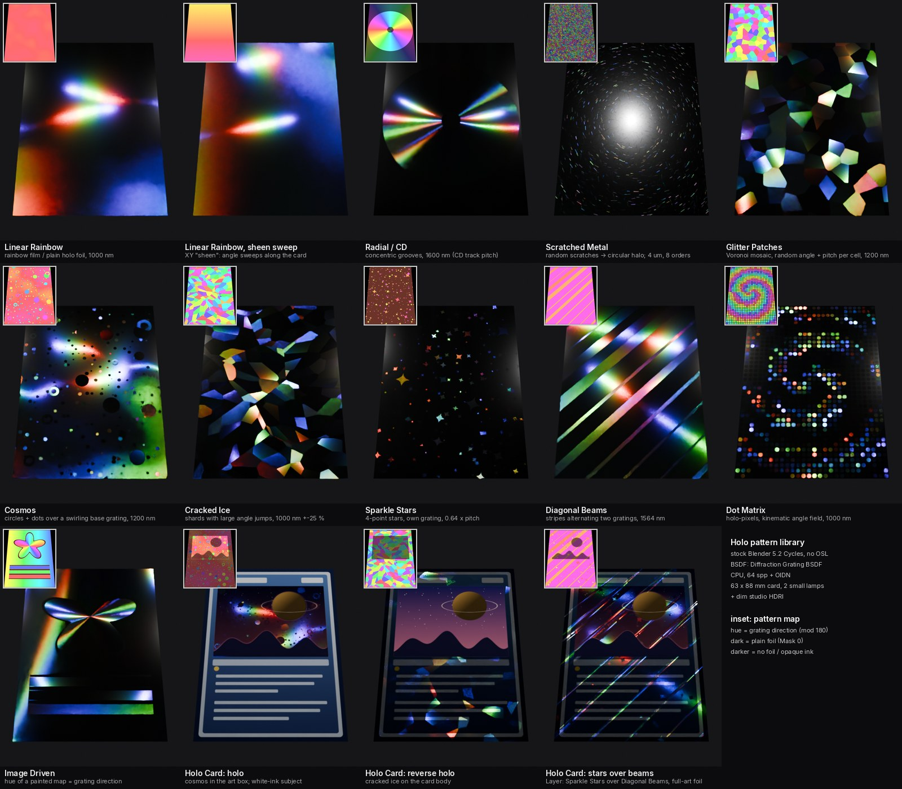

# Blender Holo Foil

Physically-based holographic foil / diffraction grating for Cycles. One node group, no OSL, GPU.

Left: a frame from Blender Guru's video. Middle: Secrop's "Balanced" shader. Right: this node group.

## Why

In a pure white room a lossless foil should vanish. Ours keeps 99.8 % of the light; Balanced keeps 41 %.

The school laser + CD experiment: ours reads back the real 1.6 µm track pitch.

How it works: [docs/HOW_IT_WORKS.md](docs/HOW_IT_WORKS.md).

## Use it

1. Download [`holo_foil.blend`](holo_foil.blend) (Blender 5.2+).
2. In your file: **File > Append > holo_foil.blend > NodeTree > Diffraction Grating BSDF**, or drag it from the
   Asset Browser.
3. Plug **BSDF** into the Material Output. The mesh needs a UV map (the grooves follow V).

The file also has 11 holo patterns (cosmos, cracked ice, stars, CD, ...), a holo-card material and two demo scenes.
Plug a pattern's Angle, Pitch Multiplier and Mask into the node's inputs of the same name.

## Main inputs

| input | what it does |
|---|---|
| Pitch (nm) | Groove spacing. Holo foil 700–1500, CD 1600, DVD 740. |
| Angle | Turns the grooves. |
| Type | 0 = grooves (1D), 1 = crossed lattice (2D, "49 copies"). |
| Roughness | Blur of the rainbows. |
| Color | Metal colour of the foil (aluminium by default). |

All inputs, patterns and denoising: [docs/INPUTS.md](docs/INPUTS.md). Rebuild and run the tests:
[scripts/README.md](scripts/README.md).

## Credits

"Balanced" diffraction shader by Miguel "Secrop" Porces, with modifications by Andrew Price / Blender Guru
(CC BY 4.0), used as the comparison reference. Inspired by Blender Guru's
["Why You Can't Render Pokemon Cards in Blender"](https://www.blenderguru.com/posts/2026/8/13/why-you-cant-render-pokemon-cards-in-blender).

## License

Code MIT ([LICENSE](LICENSE)); `holo_foil.blend` and images CC BY 4.0 ([LICENSE-ASSETS.md](LICENSE-ASSETS.md)).
